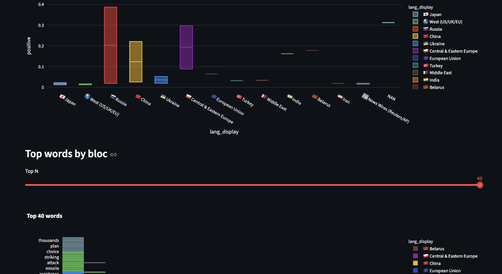

# 📰 Multilingual News Comparison

Compare how different countries' media frame the same event (Ukraine war, etc.).
Sentiment analysis + frequent words across blocs (Japan, West, Russia, China, Ukraine...).

## Features
- Sentiment analysis using XLM-R model (`cardiffnlp/twitter-xlm-roberta-base-sentiment`)
- Tokenization + stopword filtering
- Interactive UI with Streamlit + Plotly
- Supports adding new blocs via `data/news.csv`

  


## Quickstart
```bash
git clone https://github.com/<yourname>/multilingual-news-mvp.git
cd multilingual-news-mvp
python -m venv .venv && source .venv/bin/activate
pip install -r requirements.txt

python analyze.py     # process data
streamlit run app.py  # launch UI
