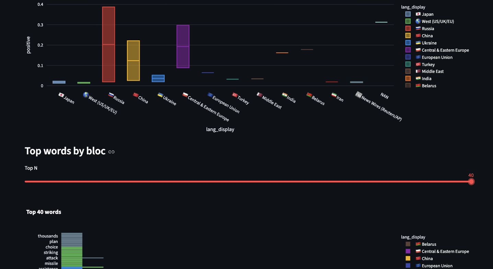

# 📰 Multilingual News Comparison

Compare how different countries' media frame the same event (Ukraine war, etc.).
Sentiment analysis + frequent words across blocs (Japan, West, Russia, China, Ukraine...).

## Features
- Sentiment analysis using XLM-R model (`cardiffnlp/twitter-xlm-roberta-base-sentiment`)
- Tokenization + stopword filtering
- Interactive UI with Streamlit + Plotly
- Supports adding new blocs via `data/news.csv`

## Future improvements

- Automatic news collection (RSS or API)
- Multi-language support
- Topic detection
- Interactive filtering
- Real-time updates

  
This dashboard compares sentiment trends and vocabulary differences between media blocs.


## What this project does

This project analyzes how different media outlets from different geopolitical blocs 
(e.g., Western vs Russian media) frame the same event using sentiment analysis 
and vocabulary comparison.

## Current limitations

- The dataset currently contains only manually collected articles about the Ukraine war
- Articles must be added manually to the CSV file
- The vocabulary analysis assumes English text
- This is an experimental MVP, not a production system


## Data format

The input file must be a CSV with the following columns:

| column | description |
|--------|------------|
| date | publication date |
| source | media outlet name |
| bloc | geopolitical bloc |
| title | article title |
| text | article body |
| url | article link |


## Quickstart
```bash
git clone https://github.com/<yourname>/multilingual-news-mvp.git
cd Multilingual-News
python -m venv .venv && source .venv/bin/activate
pip install -r requirements.txt

python analyze.py     # process data
streamlit run app.py  # launch UI


